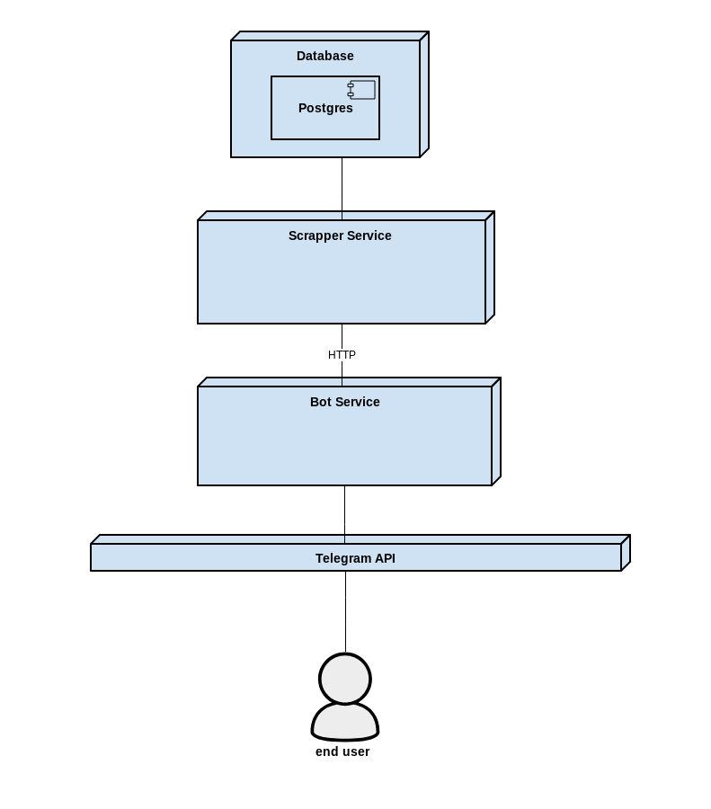
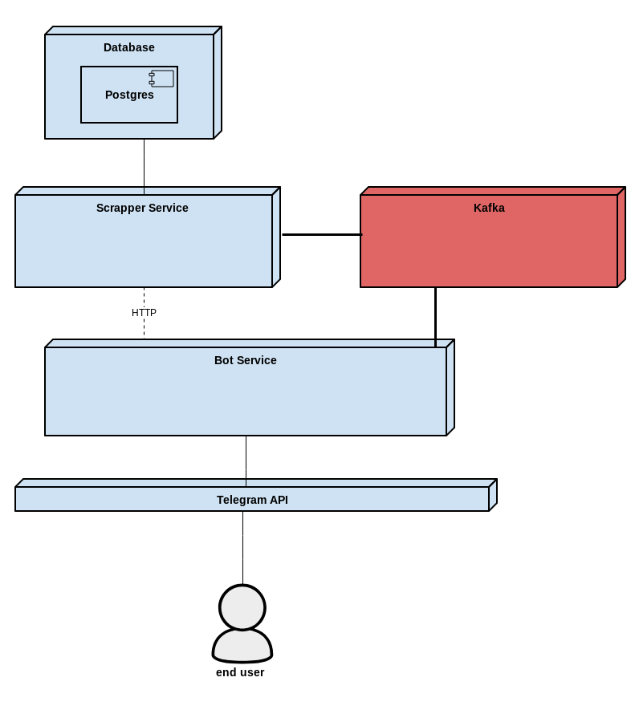
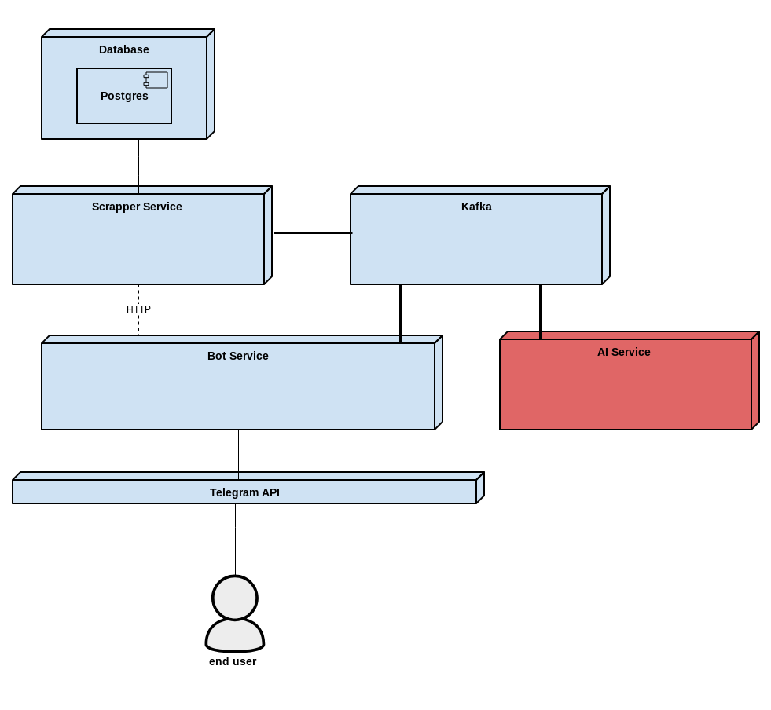

Обзор компонентов
Система разделена на три независимых сервиса, которые будут разрабатываться поэтапно:

Bot Service - управление пользователями и коммуникация через Telegram
Scrapper Service - мониторинг контента и обнаружение изменений
AI Agent Service - интеллектуальная обработка данных
Эволюция архитектуры
Проект будет развиваться поэтапно, что позволит понять различия между архитектурными подходами:

Этап 1: Базовая архитектура
Bot Service и Scrapper Service как отдельные приложения

Синхронная коммуникация через REST API

База данных PostgreSQL для хранения ссылок и их настроек

Этап 2: Добавление Kafka
Асинхронная коммуникация через Apache Kafka

REST API используется как fallback механизм

Улучшенная отказоустойчивость и масштабируемость

Этап 3: AI Agent Service
Выделение обработки контента в отдельный сервис

Суммаризация, фильтрация и интеллектуальная обработка

Описание сервисов
Bot Service
Отвечает за взаимодействие с пользователями через Telegram Bot API:

Регистрация и авторизация пользователей

Обработка команд (/track, /untrack, /list и др.)

Управление подписками через взаимодействие со Scrapper Service

Отправка уведомлений пользователям

Хранение данных о пользователях и их настройках

Scrapper Service
Осуществляет мониторинг контента:

Периодическая проверка отслеживаемых URL на наличие изменений

Парсинг контента с различных источников (GitHub, Stack Overflow, Reddit и др.)

Определение изменений (diff detection)

Отправка уведомлений в Bot Service при обнаружении обновлений

Хранение информации о подписках и состоянии контента

Методы коммуникации:

REST API для синхронной коммуникации

Apache Kafka для асинхронной обработки

AI Agent Service
Обрабатывает контент перед отправкой уведомлений:

Суммаризация длинных обновлений

Фильтрация по стоп-словам и авторам

Приоритизация обновлений

Группировка связанных обновлений

Работает как промежуточное звено между Scrapper и Bot

Работа с API
Хотя Github и StackOverflow предоставляют открытый API, но если делать частые запросы, то можно получить бан на аккаунт.

Обратите внимание, что в задании для тестов требуется использование WireMock.

В тестах его использование обязательно, в остальных случаях -- старайтесь эмулировать API при частой отладке.

FAQ
Q: Можно ли использовать NoSQL базу данных вместо PostgreSQL?
A: Нет, PostgreSQL является обязательным требованием проекта для изучения работы с реляционными БД.

Q: Обязательно ли использовать Kafka на начальных этапах?
A: Нет, Kafka добавляется позже. Начинать нужно с REST API.

Q: Что делать, если нет доступа к AI API?
A: Можно использовать бесплатные альтернативы (free tier), локальный запуск через Ollama или сделать заглушку для AI функций.
